# fastcodellama
### Self-Acceleration of Code Llama for Code Generation

<div align="center">

<h4 align="center">
    <p>
        <b>English</b> |
        <a href="https://github.com/yueliu1999/fastcodellama/blob/main/README-zh.md">中文</a>
    <p>
</h4>
</div>


### 1. Usage of Code Llama with Huggingface Transformers
Code Llama is a collection of pretrained and fine-tuned generative text models ranging in scale from 7 billion to 34 billion parameters. This model is designed for general code synthesis and understanding. Links to other models can be found in the index at the bottom.

#### Installation

This branch was created by the huggingface team to support Code Llama. Make sure to be using this temporary branch of transformers unit support is fully merged and released.

**Note: Code Llama is currently not supported by directly installed transformers**
```bash
pip install git+https://github.com/huggingface/transformers.git@main accelerate
pip install torch tensorflow sentencepiece tqdm
```

####  Quick Start
```bash
from transformers import AutoTokenizer
import transformers
import torch

model = "codellama/CodeLlama-7b-hf"

tokenizer = AutoTokenizer.from_pretrained(model)
pipeline = transformers.pipeline(
    "text-generation",
    model=model,
    torch_dtype=torch.float16,
    device_map="auto",
)

sequences = pipeline(
    'import socket\n\ndef ping_exponential_backoff(host: str):',
    do_sample=True,
    top_k=10,
    temperature=0.1,
    top_p=0.95,
    num_return_sequences=1,
    eos_token_id=tokenizer.eos_token_id,
    max_length=200,
)
for seq in sequences:
    print(f"Result: {seq['generated_text']}")

```
or 

```bash
from transformers import AutoTokenizer, AutoModelForCausalLM
import transformers
import torch

device = "cuda:0"
model_path = "codellama/CodeLlama-7b-hf"
model = AutoModelForCausalLM.from_pretrained(model_path)
tokenizer = AutoTokenizer.from_pretrained(model_path)

model.to(device)

input_text = 'import socket\n\ndef ping_exponential_backoff(host: str):'
input_ids = tokenizer.encode(input_text, return_tensors="pt").to(device)

max_length = 200
temperature = 0.1
top_k = 10
top_p = 0.95
num_return_sequences = 1
eos_token_id = tokenizer.eos_token_id

# Generate sequences using the model
output_sequences = model.generate(
    input_ids,
    max_length=max_length,
    temperature=temperature,
    top_k=top_k,
    top_p=top_p,
    num_return_sequences=num_return_sequences,
    eos_token_id=eos_token_id
)

# Decode and print the generated sequences
for output_sequence in output_sequences:
    generated_text = tokenizer.decode(output_sequence, skip_special_tokens=True)
    print(f"Result: {generated_text}")


```

### 2. fastcodellama Usage

fastcodellama is a method to losslessly accelerate subsequent code generation using the code previously generated by LLMs.

- First, match the code that has been generated above the LLMs according to the code prefix that is currently being generated
- Paste the matched code into the LLM’s current generation of , use LLMs to check, if the code is the original output of LLMs, keep it, otherwise use the original output of LLMs.
- Reduce the number of inferences through self-acceleration to achieve lossless acceleration.

#### Architecture
<div  align="center">    
    
</div>

#### Preliminary results(with one A100)

<table class="tg">
<thead>
  <tr>
    <th class="tg-c3ow"></th>
    <th class="tg-c3ow" colspan="3">Tokens/sec ↑</th>
    <th class="tg-c3ow" colspan="3">Time (sec) ↓</th>
  </tr>
</thead>
<tbody>
  <tr>
    <td class="tg-c3ow">Model</td>
    <td class="tg-c3ow">Pass@1</td>
    <td class="tg-c3ow">Pass@5</td>
    <td class="tg-c3ow">Pass@10</td>
    <td class="tg-c3ow">Pass@1</td>
    <td class="tg-c3ow">Pass@5</td>
    <td class="tg-c3ow">Pass@10</td>
  </tr>
  <tr>
    <td class="tg-c3ow">CodeLlama-7B</td>
    <td class="tg-c3ow">30.37</td>
    <td class="tg-c3ow">29.28</td>
    <td class="tg-c3ow">30.89</td>
    <td class="tg-c3ow">2146.44</td>
    <td class="tg-c3ow">10618.33</td>
    <td class="tg-c3ow">19994.44</td>
  </tr>
  <tr>
    <td class="tg-c3ow">FastCodeLlama-7B</td>
    <td class="tg-c3ow">43.91 <b>(44.58%↑)</b></td>
    <td class="tg-c3ow">43.05  <b>(47.02%↑)</b></td>
    <td class="tg-c3ow">47.94  <b>(55.20%↑)</b></td>
    <td class="tg-c3ow">1455.84  <b>(32.17%↓)</b></td>
    <td class="tg-c3ow">7289.19  <b>(31.35%↓)</b></td>
    <td class="tg-c3ow">12723.17  <b>(36.37%↓)</b></td>
  </tr>
  <tr>
    <td class="tg-c3ow">CodeLlama-13B</td>
    <td class="tg-c3ow"> 31.27 </td>
    <td class="tg-c3ow"> 31.78 </td>
    <td class="tg-c3ow"> 23.89 </td>
    <td class="tg-c3ow">2690.52  </td>
    <td class="tg-c3ow"> 13234.82 </td>
    <td class="tg-c3ow"> 34192.78 </td>
  </tr>
 <tr>
    <td class="tg-c3ow">FastCodeLlama-13B</td>
    <td class="tg-c3ow"> 42.08 <b>(34.56%↑)</b></td>
    <td class="tg-c3ow"> 39.48 <b>(24.23%↑)</b></td>
    <td class="tg-c3ow"> 47.06 <b>(96.99%↑)</b></td>
    <td class="tg-c3ow">1514.74 <b>(43.70%↓)</b></td>
    <td class="tg-c3ow"> 8179.09 <b>(38.20%↓)</b></td>
    <td class="tg-c3ow"> 13884.78 <b>(60.57%↓)</b></td>
  </tr>


[//]: # (  <tr>)

[//]: # (    <td class="tg-c3ow"></td>)

[//]: # (    <td class="tg-c3ow"></td>)

[//]: # (    <td class="tg-c3ow"></td>)

[//]: # (    <td class="tg-c3ow"></td>)

[//]: # (    <td class="tg-c3ow"></td>)

[//]: # (    <td class="tg-c3ow"></td>)

[//]: # (    <td class="tg-c3ow"></td>)

[//]: # (  </tr>)
</tbody>
</table>


#### Quick Start
One Nvidia V/A100 32GB GPU or better is recommended.

For HumanEval experiments, run the following:
```bash
# baseline decoding
python decoder_code.py --model_path /path/to/llama_model --input_data_fn ./data/HumanEval.jsonl --type base --passk 1 --output_data_fn /path/to/output_base.jsonl
# fastcodellama decoding
python decoder_code.py --model_path /path/to/llama_model --input_data_fn ./data/HumanEval.jsonl --type base --passk 1 --type fastcodellama --n 1 --k 20 --output_data_fn /path/to/output_fastcodellama.jsonl
```
- model_path: the path of Code Llama checkpoint
- input_data_fn: use OpenAI's HumanEval test data or other code generation dataset
- type: base or fastcodellama
- n: the length of the prefix mathch for fastcodellama
- k: copy code length for fastcodellama
- output_data_fn: code generation output in HumanEval format

### Acknowledgements

- [CodeLlama](https://github.com/facebookresearch/codellama): the official implement of codellama
- [CodeLlama_hf](https://huggingface.co/codellama/CodeLlama-7b-hf): the repository for the base 7B version in the Hugging Face Transformers format. 
- [LLMA](https://github.com/facebookresearch/codellama): the official implement of LLMA, our code was created based on LLMA.
